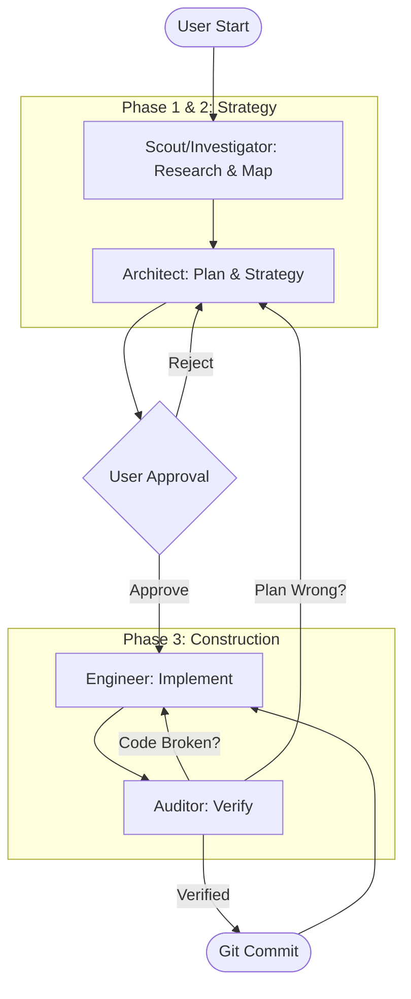

# Universal Gemini Swarm & Modernization Toolkit

A comprehensive Gemini CLI Extension that provides a **Multi-Agent Swarm** for autonomous software development, alongside specialized, **stack-agnostic** pipelines for **Feature Planning** and **SQL-to-DDD Refactoring**.

**See** [Gemini CLI Extensions](https://github.com/google-gemini/gemini-cli/blob/main/docs/extensions/index.md) for more details.

**Credits**: [@dandobrin](https://github.com/ddobrin), [@jjdelorme](https://github.com/jjdelorme) & [@cedricyao](https://github.com/cedricyao). Parts of this work were adapted from Dan's [production serverless repository](https://github.com/GoogleCloudPlatform/serverless-production-readiness-java-gcp/tree/main/genai/quotes-llm/.gemini/commands), and Jason's [plan-commands](https://github.com/jjdelorme/plan-commands)

## Prerequisites
Install the [Gemini CLI](https://github.com/google-gemini/gemini-cli)

## Extension Installation
From your command line:

```bash
gemini extensions install https://github.com/ypenn21/agent-dev-team-roundtable.git
```

### Activating the Swarm Supervisor (Per-Workspace)

While the agents (`architect`, `engineer`, `auditor`) are installed globally by the extension, the **Supervisor** (`system.md`) must be activated locally in each project you want to use it in.

1. Navigate to your project directory.
2. Run the initialization command:
   ```bash
   /swarm:init
   ```
   *(This downloads the `system.md` file into your local `.gemini/` folder).*
3. **Restart** the Gemini CLI with the system override enabled:
   ```bash
   GEMINI_SYSTEM_MD=true gemini
   ```

---

## 🤖 1. The Autonomous Swarm

This extension packages a portable, framework-agnostic AI agent swarm designed to manage the software development lifecycle using a rigorous **Plan -> Act -> Verify** state machine.

### The Agents
*   **Supervisor (`system.md`)**: The Project Manager. Enforces the state machine, manages hand-offs, and gates Git commits.
*   **Architect (`architect`)**: The Planner. Reads research, creates comprehensive step-by-step TDD implementation plans in the `plans/` directory.
*   **Engineer (`engineer`)**: The Builder. Strictly follows the Architect's plans, writing tests and implementing changes via Red-Green-Refactor.
*   **Auditor (`auditor`)**: The Gatekeeper. Verifies the Engineer's work. Compiles code, runs tests, and hunts for lazy AI shortcuts (TODOs, commented-out tests).

### 🔄 Protocol Lifecycle
The system moves through distinct phases, enforced by the Supervisor.



### Workspace Maintenance: Archiving Plans
As the Swarm executes tasks, your `plans/` directory will accumulate executed task files, research reports, and review feedback. To keep the agent's context window clean and focused, you can archive completed items:

```bash
/swarm:archive
```
